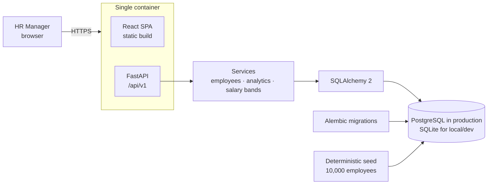
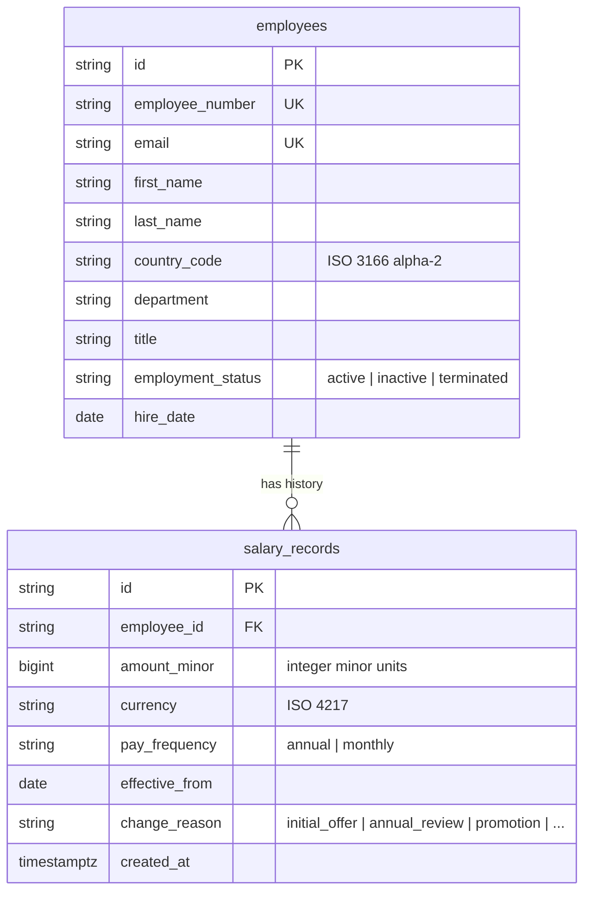

# Architecture



One deployable: the image builds the UI and FastAPI serves it next to the API, so there is
no CORS, one URL, and one thing to operate. The UI can still be hosted separately
(`VITE_API_BASE_URL` + `CORS_ORIGINS`).

## Backend (`backend/`)

| Layer | Responsibility | Files |
|---|---|---|
| API | HTTP contracts, input validation (Pydantic), error mapping (404/409/422) | `app/api/*`, `app/schemas/*` |
| Services | Business rules: append-only salary history, current-salary rule, analytics | `app/services/*` |
| Persistence | ORM models, sessions, migrations | `app/models/*`, `app/db/*`, `alembic/` |
| Delivery | SPA serving, configuration | `app/frontend.py`, `app/core/config.py` |

### Data model



**Salary is history, not a field.** Records are only ever inserted. An employee's *current*
salary on a date is the record with the latest `effective_from` on or before that date;
same-day corrections are ordered by `created_at` (microsecond, app-generated) then `id`.
The same rule is implemented in SQL (analytics) and Python (profile), and both are tested.
Future-dated records (scheduled raises, up to one year ahead) are stored but not current.

### Analytics pipeline

1. Build the *current compensation* set for the filters with a `NOT EXISTS` anti-join
   (served by the `(employee_id, effective_from, created_at)` index).
2. Materialize it once per request into a uniquely named temporary table.
3. Run every aggregate over it in SQL: headcount; payroll, average and median per currency,
   per country+currency and per department+currency; per-currency salary bands; top/bottom 5
   per currency (window functions). Recent changes come from the salary table directly.
4. Monthly pay is annualized (×12). Nothing is ever summed across currencies.

Median is computed with portable window functions so SQLite and PostgreSQL agree; the whole
backend suite runs on both engines in CI. See [performance.md](performance.md) for timings.

## Frontend (`frontend/`)

```
src/
  api/          typed fetch client, endpoint functions, API types
  app/          shell layout, routes (lazy-loaded pages), theme, query client
  components/   loading / error / empty states, status chip
  features/
    employees/  directory, filters, profile, salary change + add employee dialogs,
                form validation, URL state, history derivation
    analytics/  dashboard, filters, charts, tables, currency selection
  lib/          money (minor-unit parsing/formatting), labels, debounce
```

- **Server state** lives in TanStack Query; a salary write invalidates the directory,
  profile and analytics caches, so every screen reflects the change.
- **View state** (filters, sort, page, chart currency) lives in the URL, so views are
  shareable and survive refresh.
- **Money** is parsed from what the user types into integer minor units with string
  arithmetic; floats are used only to format for display.
- Pure logic (validation, URL state, history derivation, currency choice) sits in `.ts`
  modules next to the components and is unit-tested directly.

## Testing strategy

| Level | Tooling | What it proves |
|---|---|---|
| Backend unit + API | pytest, FastAPI TestClient, SQLite **and** PostgreSQL | business rules, validation, analytics correctness, seed determinism, SPA serving |
| Frontend unit + component | Vitest, Testing Library (API mocked at module boundary) | money handling, forms, URL state, rendering of history/dashboard, error states |
| End-to-end | Playwright against the real container layout on a seeded 10k database | the HR journey: find → raise → see it in profile, history and dashboard |
