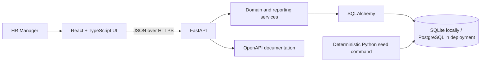

# Architecture Overview

## Boundaries

The React client presents responsive, accessible HR workflows. FastAPI owns validation, authorization seams, API contracts, and error responses. Services hold salary-history and reporting rules. SQLAlchemy models and Alembic migrations own relational persistence.

## Data model

- `employees`: immutable identifier, employee number, name, email, country, department, title, employment status, hire date, timestamps.
- `salary_records`: employee foreign key, `amount_minor`, currency, pay frequency, effective date, reason, creator, and timestamp.

The latest eligible salary record is current compensation. Salary is not duplicated as a mutable employee column, preventing silent history loss.

## Scaling posture

Employee list and analytics filters are evaluated in the database. List endpoints use bounded server-side pagination and a sort allowlist. Reporting endpoints return grouped aggregates, not raw employee datasets. Required indexes will include employee identifiers, common filter combinations, and `(employee_id, effective_from DESC)` for salary history.

## Local-to-production portability

SQLite reduces setup cost for assessment review. The schema and SQLAlchemy access layer are designed to run against PostgreSQL in deployment. Database-specific analytics (notably median) will be isolated, documented, and covered by fixtures.
